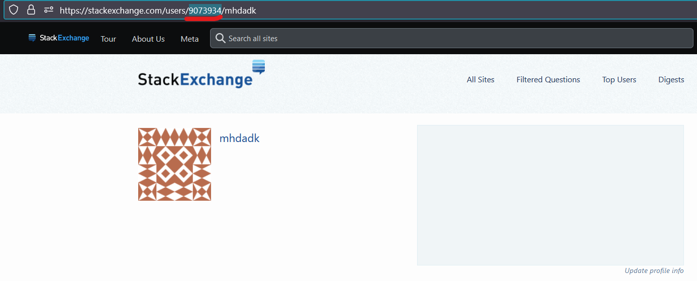

# Stack Exchange Backup

Download all of your questions and answers from all Stack Exchange (SE) sites using a Python script and the [SE API](https://api.stackexchange.com/).

# Getting started

To get started, make sure that Python version 3.11.7 or newer is installed. Then, run the
following commands (note that these commands were tested in Powershell, and so only one of these commands will need to be translated for use in bash, zsh, etc.):
```bash
git clone https://github.com/mhdadk/stack-exchange-backup.git
cd stack-exchange-backup
# create a virtual environment
python -m venv .venv
# activate the virtual environment. This command should be translated when using bash
.venv\Scripts\activate
python -m pip install "requests==2.31.0"
```
Finally, determine your SE network user ID by doing the following:

1. Go to https://stackexchange.com/.
2. Log in to your SE account.
3. Click on your profile picture on the top-right, as indicated by the red arrow in the screenshot below.

4. Go to the address bar in your browser, and the address should be in the form `https://stackexchange.com/users/<user id>/<user name>`. For example, the screenshot below shows my `user id` as `9073934` and my `user name` as `mhdadk`. Note/save the `user id` from the address bar that is shown for your account, as this will be needed later. 


Go to the "Usage" section below for the final step.

# Usage

Once the steps under the section "Getting started" above are done, you can then download all of your questions and answers from all SE sites by running the following command:
```powershell
python main.py --user_id <user id>
```
where `<user id>` should be replaced with your own `user id` that you obtained by following the instructions under the "Getting started" section above.

# Format

Once the commnand under the "Usage" section is run, a `q_and_a` directory will be created inside the directory from which the command was run. This directory will have the following structure:
```bash
<stack exchange site 1>.com
|--- questions
|---|--- <question 1 id>.md
|---|--- <question 2 id>.md
|---|--- ...
|--- answers
|---|--- <question id associated with answer 1 id>.md
|---|--- <question id associated with answer 2 id>.md
|---|--- ...
<stack exchange site 2>.com
|--- questions
|---|--- <question 1 id>.md
|---|--- <question 2 id>.md
|---|--- ...
|--- answers
|---|--- <question id associated with answer 1 id>.md
|---|--- <question id associated with answer 2 id>.md
|---|--- ...
...
```
where
* `<stack exchange site n>` is the name for the `n`th SE site associated with a user.
* `<question n id>` is the question ID associated with `n`th question for the parent SE site.
* `<question id associated with answer n id>` is the question ID associated with the `n`th answer for the parent SE site.

See the "Logic" section below for an overview of how the `main.py` file works. 

# Logic

This section is intended for anyone interested in how the `main.py` file works, and is completely optional.


# Alternatives

Although there are alternative ways of doing this,
such as using [`stackapi`](https://github.com/AWegnerGitHub/stackapi) and the stack
exchange data explorer, this method uses
only 1 dependency: the `requests` package. This minimizes the risk of obscelesence in
the future.